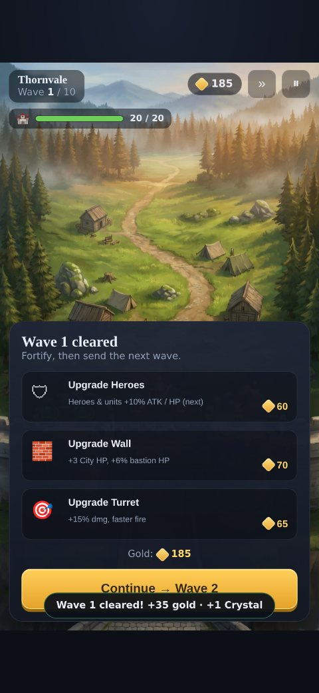
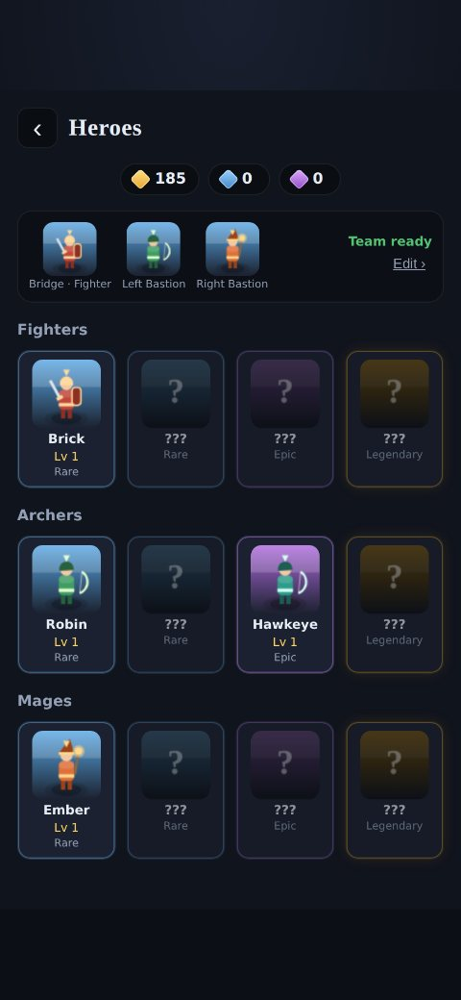

# Last Wall

> Hold the bridge. Defend the city.

**Last Wall** is a stylized-fantasy, **portrait / iPhone-style city-defense gacha game**. Monsters
emerge from a forest at the top of the screen, march down a winding path through an open field,
and funnel toward a fortified wall with two bastions and a central gate. You deploy **3 heroes** —
a **Fighter** holding the bridge choke point and two ranged **Archer/Mage** heroes on the
bastions — each with **2 matching support units**. Survive 10 waves per city, upgrade between
waves, earn summon crystals, and pull new heroes from the gacha.

This repository implements the [`Last Wall` design/build file](#design-source) as a **browser
game** — a single-page, dependency-free app using **vanilla JavaScript + HTML5 Canvas**. The code
is organized to mirror the Unreal Engine blueprint structure described in the build file.

| Menu | Battle | Upgrades | Summon | Roster |
|---|---|---|---|---|
|  |  |  |  |  |

---

## Play it

No build step and **no dependencies** — it runs straight from the file system.

- **Quickest:** open `index.html` in any modern browser (works over `file://`).
- **Served (recommended for mobile testing):**
  ```bash
  npm run serve          # serves on http://localhost:8000
  # or:  python3 -m http.server 8000
  ```
  then open the URL on your phone/emulator in portrait.

Progress (currencies, heroes, levels, team, campaign) saves automatically to `localStorage`.

---

## The game loop

1. **Campaign** — 10 cities, each with 10 waves. Pick an unlocked city.
2. **Battle** — enemies spawn from the forest and follow one winding spline path. Your bastion
   heroes + turret rain fire on the field; the Fighter group blocks the bridge choke. If enemies
   breach the bridge they damage **City HP** — lose all of it and the wall falls.
3. **Between waves** — spend gold to **Upgrade Heroes / Wall / Turret**, then continue.
4. **Rewards** — every wave grants gold + **1 Regular Crystal**; clearing a city grants bonus gold +
   **1 Epic Crystal** and unlocks the next city.
5. **Summon** — spend crystals on two banners; level up and re-team your roster.

### Classes & positions (exactly 3 hero slots)
- **Bridge** — Fighters only (tanky melee blocker + small cleave).
- **Left / Right Bastion** — Archers or Mages only (Archer = long-range single target; Mage =
  shorter range with splash).
- Each hero auto-spawns **2 matching support units** (40% HP / 35% ATK of the parent). Units
  despawn when their hero dies and are re-manned each wave.

### Gacha rates
- **Regular banner:** Rare 85% · Epic 15% · Legendary 0%.
- **Epic banner:** Epic 75% · Legendary 25%, with **pity — a guaranteed Legendary after 5
  consecutive non-Legendary pulls**. Duplicates convert to gold.

---

## Project structure

Files map directly onto the blueprints from the build file:

```
index.html              # loads all modules in order; portrait stage
assets/battlefield.jpg  # hand-painted battlefield illustration (drawn each battle)
css/style.css           # stylized-fantasy mobile theme
js/
  util.js               # math, RNG, weighted pick, tiny DOM + event helpers
  data/
    config.js           # ALL balance constants, layout anchors, spline points
    heroes.js           # 12 heroes (4 Fighter / 4 Archer / 4 Mage)
    enemies.js          # 6 enemy types (Slime…Ogre boss)
    levels.js           # procedural 10x10 wave generator
  core/
    SaveGame.js         # BP_LW_SaveGame      - localStorage persistence
    GameInstance.js     # BP_LW_GameInstance  - currencies, progression, pity
    HeroCollection.js   # BP_HeroCollectionManager - ownership, leveling, team, stats
    SummonManager.js    # BP_SummonManager    - rolls, rarity tables, pity
  battle/
    Spline.js           # Spline_EnemyPath_Main - Catmull-Rom arc-length path
    BattleMap.js        # BP_BattleMapController - anchors + painted battlefield bg
    BattleManager.js    # BP_BattleManager    - wave state machine, combat queries
    Combatant.js        # shared targeting/attack base
    Hero.js             # BP_HeroBase
    SupportUnit.js      # BP_SupportUnitBase
    Enemy.js            # BP_EnemyBase        - spline movement + bridge blocking
    Turret.js           # BP_TurretBase
    CityWall.js         # BP_CityWall
    Projectile.js / Effects.js / Render.js   # VFX + procedural sprite painters
  ui/UI.js              # all UMG-style screens, HUD, panels, overlays
  main.js               # App: canvas render loop, battle lifecycle
test/
  headless.js           # node harness: simulates battles + smoke-renders UI
  shots.js              # optional Playwright screenshot/console-error tool
```

All tuning lives in **`js/data/config.js`** (class stats, rarity multipliers, level costs, gacha
tables, upgrade values, layout anchors, the enemy spline). Want a tougher campaign or a different
fortress layout? Edit the data, not the systems.

---

## Tests

A dependency-free Node harness mocks just enough of the browser to load the **real** game scripts,
then simulates full battles and smoke-renders every UI screen:

```bash
npm test          # node test/headless.js
```

It verifies the acceptance criteria, e.g.: enemies are blocked at the bridge, city 0 is winnable
without upgrades, the upgrade path works, a late city is lost without investment but winnable with
it, the regular banner never yields a Legendary, and the Epic pity gap never exceeds 5.

Optional visual check (needs `npx playwright install chromium`):

```bash
npm run shots     # renders in Chromium -> ./screenshots, reports console errors
```

---

## Acceptance criteria — where they live

| Requirement | Implementation |
|---|---|
| Forest -> field -> winding path -> wall/2 bastions/gate -> bridge layout | `battle/BattleMap.js` |
| Enemies spawn at top forest, follow one winding path | `battle/Spline.js`, `Enemy.js` |
| Exactly 3 hero positions; bridge=Fighter, bastions=Archer/Mage | `core/HeroCollection.js`, `BattleManager._deployTeam` |
| Each hero spawns 2 matching support units | `battle/Hero.spawnSupportUnits` |
| Enemies blocked at the bridge by the Fighter group | `BattleManager._updateBlocking`, `Enemy.update` |
| Turret fires automatically | `battle/Turret.js` |
| Gold + Regular Crystal each wave; Epic Crystal each city | `core/GameInstance.rewardWave / completeCity` |
| Upgrade Heroes / Wall / Turret between waves | `BattleManager.buyUpgrade`, `ui/UI._showUpgradePanel` |
| Epic pity -> guaranteed Legendary after 5 | `core/SummonManager._rollRarity` |

---

## Design source

This build realizes the **"Last Wall — Unreal Engine Build File"** spec as a browser prototype.
Where the spec describes Unreal/UMG concepts, the equivalent web technology is used (Canvas 2D for
the perspective battle scene, DOM for menus, `localStorage` for the save game), while keeping the
same systems, data tables, and naming so the design intent is preserved.

The battlefield itself (`assets/battlefield.jpg`) is a hand-painted-style fantasy illustration that
sets the art direction — misty forest spawn, winding field path, chunky stone wall with two round
bastions and a central gate, and a cobblestone bridge to the city. Heroes, support units, enemies,
projectiles and VFX are drawn procedurally on top, with depth-scaled sizing for a 2.5D feel.
