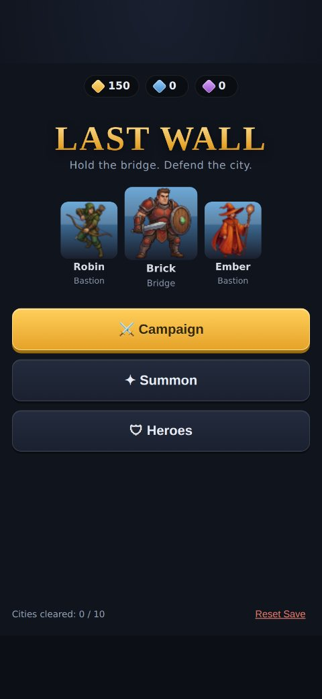
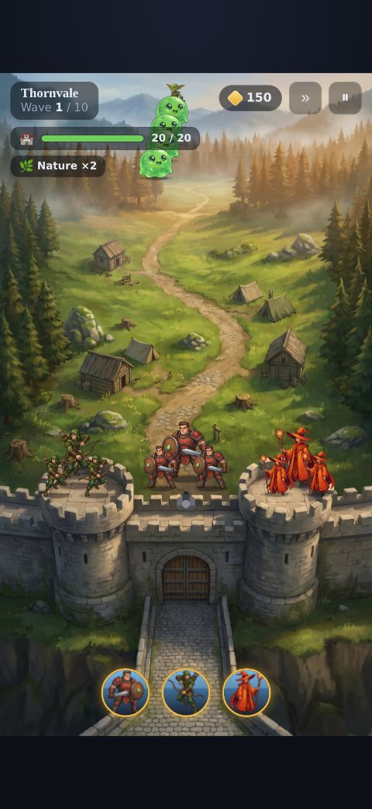
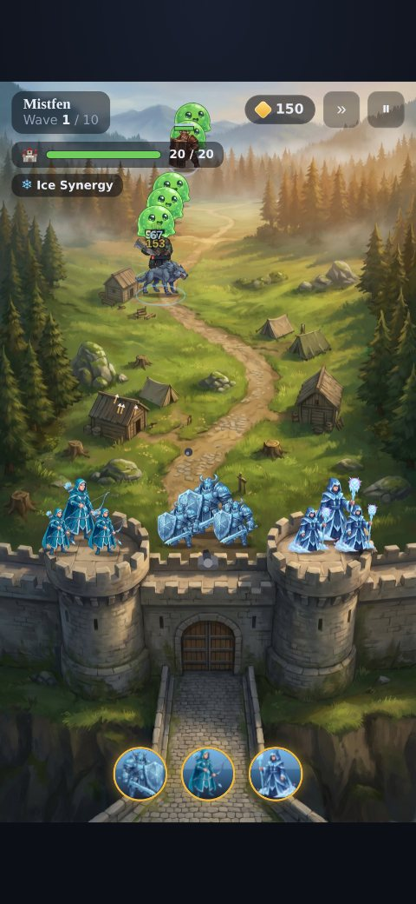
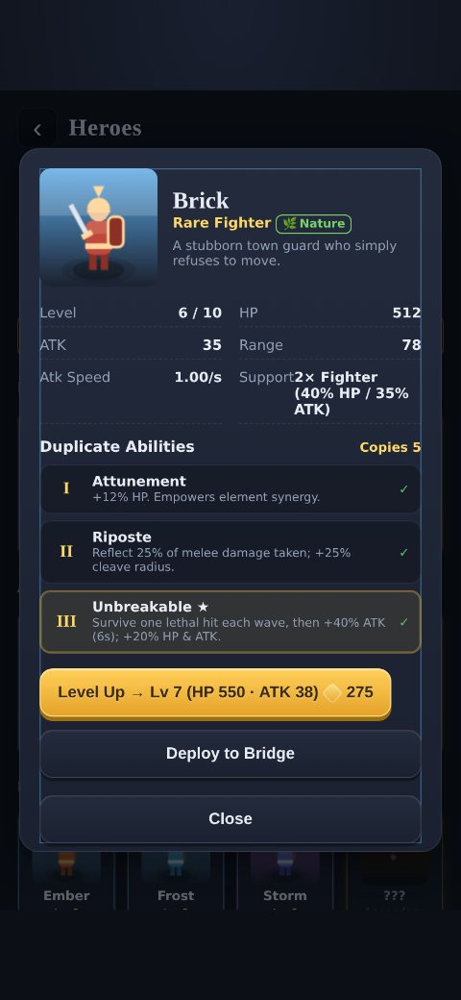
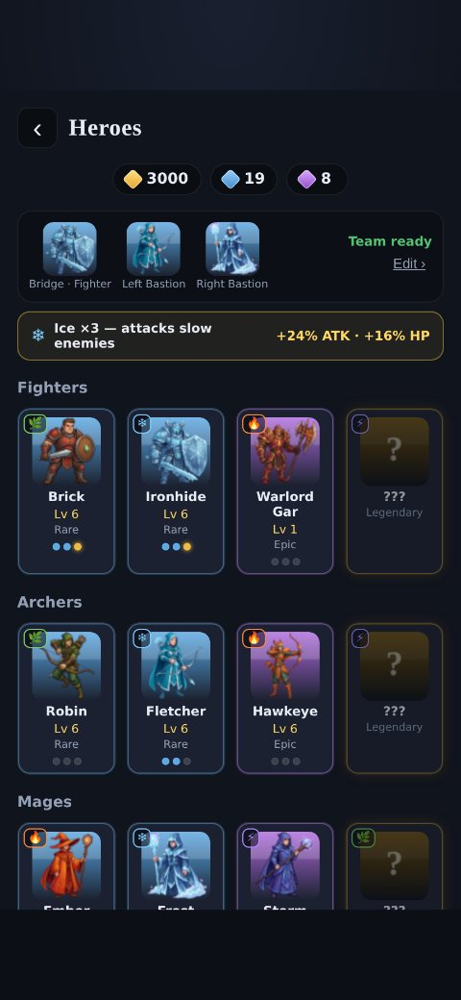
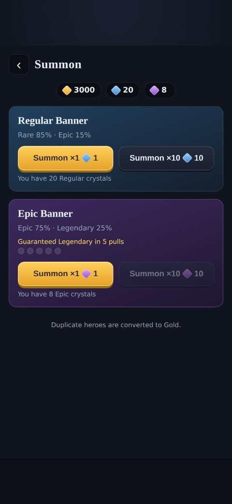

# Last Wall

> Hold the pass. Defend the castle.

**Last Wall** is a stylized-fantasy, **landscape / iPhone-style tower-defense gacha game**. Monsters
pour out of a **Demonic Gate** and march along a **winding road** ("Ironcove Pass") — across a river
bridge — toward the **player's castle**. You **build towers** on the dirt-circle plots along the
road — **Archer** (single-target), **Mage** (splash) and **Guard Post** (spawns blocking infantry) —
and deploy **3 gacha heroes**: two ranged **Archer/Mage** heroes hold the **rune bastions** that
flank the road, and a **Fighter** hero stands on the road in front of the castle to block the choke.
Heroes fight **alone** (no support units). Survive 10 waves per map, spend gold on towers and
upgrades, earn summon crystals, and pull new heroes from the gacha.

This repository implements the [`Last Wall` design/build file](#design-source) as a **browser
game** — a single-page, dependency-free app using **vanilla JavaScript + HTML5 Canvas**. The code
is organized to mirror the Unreal Engine blueprint structure described in the build file.

| Menu | Battle + Skills | Combat 2.0 | Abilities | Synergy | Summon |
|---|---|---|---|---|---|
|  |  |  |  |  |  |

---

## Play it

No build step and **no dependencies** — it runs straight from the file system.

- **Quickest:** open `index.html` in any modern browser (works over `file://`).
- **Served (recommended for mobile testing):**
  ```bash
  npm run serve          # serves on http://localhost:8000
  # or:  python3 -m http.server 8000
  ```
  then open the URL on your phone/emulator in landscape.

Progress (currencies, heroes, levels, team, campaign) saves automatically to `localStorage`.

---

## The game loop

1. **Campaign** — 10 maps, each with 10 waves. Pick an unlocked map.
2. **Battle** — enemies emerge from the Demonic Gate and follow the winding road. Your bastion
   heroes + castle cannon rain fire on the road; the Fighter's vanguard blocks the choke in front of
   the castle. If enemies reach the castle they damage **City HP** — lose all of it and the castle falls.
3. **Between waves** — spend gold to **Upgrade Heroes / Wall / Turret**, then continue.
4. **Rewards** — every wave grants gold + **1 Regular Crystal**; clearing a map grants bonus gold +
   **1 Epic Crystal** and unlocks the next map.
5. **Summon** — spend crystals on two banners; level up and re-team your roster.

### Towers (built on plots for gold)
- Tap a **dirt-circle plot** during battle to build an **Archer** (fast single-target), **Mage**
  (splash) or **Guard Post** tower. Guard Posts have no ranged attack — they maintain a squad of
  **blocking infantry** that march to the path and body-block monsters (respawning when killed).
- Towers auto-target and auto-fire; sell a tower back for a fraction of its cost.

### Heroes & positions (exactly 3 hero slots, deployed alone)
- **Fighter** — placed on the road in front of the castle; blocks the choke (melee + small cleave).
- **Left / Right Bastion** — Archers or Mages only (Archer = long-range single target; Mage =
  shorter range with splash), standing alone on the rune bastions.
- Heroes fight **by themselves** — no support units.

### Gacha rates
- **Regular banner:** Rare 85% · Epic 15% · Legendary 0%.
- **Epic banner:** Epic 75% · Legendary 25%, with **pity — a guaranteed Legendary after 5
  consecutive non-Legendary pulls**.
- New players start with **0 summon crystals** (and the 3 Rare starters) — crystals are earned.
- Duplicates of an owned hero unlock that hero's **special abilities** (see below); extra copies
  past the third ability convert to gold.

## Duplicate abilities & element synergy

Two power systems reward collecting and team-building:

**Duplicate abilities** — every hero has **3 special abilities** unlocked by pulling **copies** of
that hero (at **1 / 2 / 4** copies). The third unlock is the most powerful — a signature *ultimate*
(e.g. Archer's *Rain of Arrows*, Mage's *Cataclysm*) or game-changer (Fighter's *Unbreakable*:
cheat death once per wave). Lower tiers add stats and perks (reflect, extra projectile, slow-on-hit…).

**Element synergy** — every hero has an **element** (Ice 🔵 Fire 🔴 Nature 🟢 Storm 🟣); each element
has one Fighter, Archer and Mage so a full mono-element team is buildable. The 3 deployed heroes'
elements grant a team bonus:
- **2 sharing** → minor synergy (+ATK).
- **3 sharing** → major synergy: team ATK/HP **plus an element effect** — Ice slows, Fire burns,
  Nature regenerates, Storm attacks faster.

The two systems interlock as the build file describes: a hero's **first duplicate ability is
"Attunement"**, which **empowers its synergy contribution** — a fully-attuned mono-element team gets
a stronger synergy bonus.

## Combat depth (2.0)

Clearing a wave is a tactical read, not just an auto-battle:

- **Damage types + elemental affinities.** Hits are physical or magic and carry the hero's element.
  Enemies have armor/wards, an element weakness (×1.5) / resistance (×0.6) and status immunities —
  so team/element choice is a per-city puzzle. Damage numbers are colour-coded by effectiveness.
- **Status combos.** Ice chills → **freezes** (3 stacks, or instantly on a Wet target); a physical
  hit **shatters** frozen enemies for bonus damage; Fire **burns** (and **ignites** oiled targets for
  AoE); Water **douses** fire; Storm **shocks** and **chains** through Wet enemies. Mixing elements on
  a team unlocks the combos.
- **Enemy archetypes that demand counters.** **Flying** (Harpy — bypasses the Fighter, ranged-only),
  **Armored** (Frost Knight — weak to magic), **Shielded** (magic half-pierces the shield), **Healer**
  (Necromancer — focus-kill it), **Splitter** (Slime → slimelets), **Burrower** (Tunneler skips the
  field), **Berserker** (Wolf/Ogre enrage), **Bannerman** (Warboss buffs nearby). Each is introduced
  city by city to teach its counter.
- **Per-hero active skills.** Every deployed hero has a tap-aimed skill on a cooldown — Fighter
  *Whirlwind* (self AoE + knockback to reset the choke), Archer *Arrow Storm* and Mage *Cataclysm*
  (aim a burst anywhere in range). The **tier-3 duplicate ability upgrades the skill**. Tap a skill
  button, then tap the field to cast.
- **The winding road.** Enemies follow the road as three closely-spaced trails. The Fighter's
  vanguard can only physically block the **centre** trail; the two **flanking** trails have no melee
  blocker and must be cleared by your bastion ranged heroes + castle cannon + skills (ranged
  auto-prioritise whoever is closest to the castle). You can't hold everything — decide where to commit.
- **Roguelite waves.** Between waves you get a **threat preview** of the next wave's enemies and a
  **push-your-luck** choice of wave modifier — Frenzied, Armored, Swarm, Misty (your range is cut),
  Regenerating, Blood Moon. Tougher affixes pay out more gold + crystals.

---

## Project structure

Files map directly onto the blueprints from the build file:

```
index.html              # loads all modules in order; landscape (16:9) stage
assets/map_ironcove.png # painted "Ironcove Pass" battle map (drawn as the background)
assets/towers/          # animated tower frames a hero garrisons (archer/mage/guard)
assets/*_Tower.jpg      # source asset sheets the tower sprites were extracted from
assets/sprites/         # 25 painted, transparent character/enemy sprites
css/style.css           # stylized-fantasy mobile theme (landscape)
js/battle/BattleMap.js  # draws the Ironcove Pass map + the garrisoned towers
js/
  util.js               # math, RNG, weighted pick, tiny DOM + event helpers
  data/
    config.js           # ALL balance constants, layout anchors, spline points
    heroes.js           # 15 heroes (4 Fighter / 7 Archer / 4 Mage)
    enemies.js          # 10 enemy archetypes (Slime…Ogre, Harpy, Knight…)
    levels.js           # procedural 10x10 wave generator
  core/
    SaveGame.js         # BP_LW_SaveGame      - localStorage persistence
    GameInstance.js     # BP_LW_GameInstance  - currencies, progression, pity
    HeroCollection.js   # BP_HeroCollectionManager - ownership, leveling, team, stats
    SummonManager.js    # BP_SummonManager    - rolls, rarity tables, pity
    Synergy.js          # element team-synergy calculator
  battle/
    Spline.js           # Spline_EnemyPath_Main - Catmull-Rom arc-length path
    BattleMap.js        # BP_BattleMapController - anchors + procedural Ironcove Pass map
    BattleManager.js    # BP_BattleManager    - wave state machine, combat queries
    Combatant.js        # shared targeting/attack base
    Hero.js             # BP_HeroBase
    SupportUnit.js      # BP_SupportUnitBase
    Enemy.js            # BP_EnemyBase        - spline movement + vanguard blocking
    Turret.js           # BP_TurretBase
    CityWall.js         # BP_CityWall
    Anim.js             # procedural 2-3 frame idle/walk/attack sprite animation
    Projectile.js / Effects.js / Render.js   # VFX + painted sprite billboards (+ fallback)
  ui/UI.js              # all UMG-style screens, HUD, panels, overlays
  main.js               # App: canvas render loop, battle lifecycle
test/
  headless.js           # node harness: simulates battles + smoke-renders UI
  shots.js              # optional Playwright screenshot/console-error tool
```

All tuning lives in **`js/data/config.js`** (class stats, rarity multipliers, level costs, gacha
tables, **duplicate-ability tiers, element synergy bonuses**, upgrade values, **enemy scaling**,
layout anchors, the enemy spline). Want a tougher campaign or a different fortress layout? Edit the
data, not the systems.

### Difficulty

The campaign is tuned to be challenging with two viable power paths (verified by the test harness):
base heroes stall in the early cities, leveling alone tops out mid-campaign, and the final cities
require **either** level 10 + between-wave upgrades **or** leveling + element synergy + tier-3
duplicate abilities. Mixing both makes the endgame comfortable.

---

## Tests

A dependency-free Node harness mocks just enough of the browser to load the **real** game scripts,
then simulates full battles and smoke-renders every UI screen:

```bash
npm test          # node test/headless.js
```

It verifies the acceptance criteria, e.g.: enemies are blocked at the vanguard, map 1 is winnable
without upgrades, the upgrade path works, a late map is lost without investment but winnable with
it, the regular banner never yields a Legendary, the Epic pity gap never exceeds 5, and a fully
collected Legendary is retired from the wish pool (no duplicate legends).

Optional visual check (needs `npx playwright install chromium`):

```bash
npm run shots     # renders in Chromium -> ./screenshots, reports console errors
```

---

## Acceptance criteria — where they live

| Requirement | Implementation |
|---|---|
| Demonic Gate -> winding road -> river/bridge -> castle, 2 rune bastions | `battle/BattleMap.js`, `config.lanes` |
| Enemies spawn at the Demonic Gate, follow 3 road trails | `battle/Spline.js`, `Enemy.js`, `BattleManager.pickLane` |
| 3 hero positions; Fighter on the path, bastions=Archer/Mage (alone) | `core/HeroCollection.js`, `BattleManager._deployTeam` |
| Landscape road + roguelite affix waves + per-hero active skills | `BattleManager`, `config.AFFIXES/ACTIVE_SKILLS`, `ui/UI.js` |
| Build Archer/Mage/Guard towers on plots for gold (auto-fire) | `battle/Tower.js`, `BattleManager.buildTower`, `config.PLOTS/TOWER_TYPES` |
| Guard Post spawns blocking infantry on the path | `battle/Infantry.js`, `Tower._updateGuard` |
| Enemies blocked by the Fighter hero + guard infantry | `BattleManager._updateBlocking/_blockerLines`, `Enemy.update` |
| Turret fires automatically | `battle/Turret.js` |
| Gold + Regular Crystal each wave; Epic Crystal each city | `core/GameInstance.rewardWave / completeCity` |
| Upgrade Heroes / Wall / Turret between waves | `BattleManager.buyUpgrade`, `ui/UI._showUpgradePanel` |
| Epic pity -> guaranteed Legendary after 5 | `core/SummonManager._rollRarity` |
| Duplicate copies unlock 3 ability tiers (3rd strongest) | `core/HeroCollection.abilityMods`, `config.ABILITIES` |
| Element team synergy (e.g. 3× Ice) | `core/Synergy.js`, `BattleManager._deployTeam` |

---

## Design source

This build realizes the **"Last Wall — Unreal Engine Build File"** spec as a browser prototype.
Where the spec describes Unreal/UMG concepts, the equivalent web technology is used (Canvas 2D for
the perspective battle scene, DOM for menus, `localStorage` for the save game), while keeping the
same systems, data tables, and naming so the design intent is preserved.

The battlefield — **"Ironcove Pass"** — is **painted procedurally** by `battle/BattleMap.js` to a
cached offscreen canvas, so the art lines up exactly with the movement splines: a grassy landscape
with a Demonic Gate spawn, a winding dirt road, a river crossed by a wooden bridge, two rune bastions
flanking the road, and the player's castle. The 15 heroes and 10 enemy types
are **painted billboard sprites** (`assets/sprites/`, transparent PNGs) drawn on top as foot-anchored,
depth-scaled, facing-flipped billboards. Each gets **simple 2-3 frame animation** (`Anim.js`) —
a stepped idle breathe, a walk waddle (moving enemies) and a 3-frame wind-up → strike/cast →
recover attack — synthesized procedurally from the single painted frame (squash/stretch + lean +
lunge), so there's no inter-frame jitter and no extra art needed. Support units reuse their hero's
sprite. Projectiles, VFX and the procedural sprite painters remain an automatic fallback if an
image is missing, so the game still runs with no assets.
